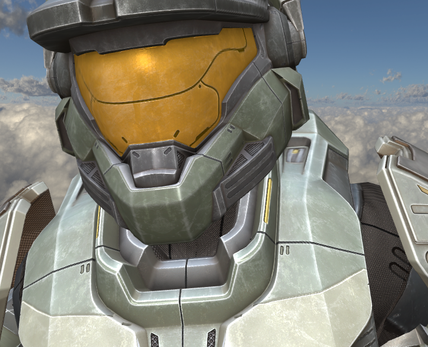
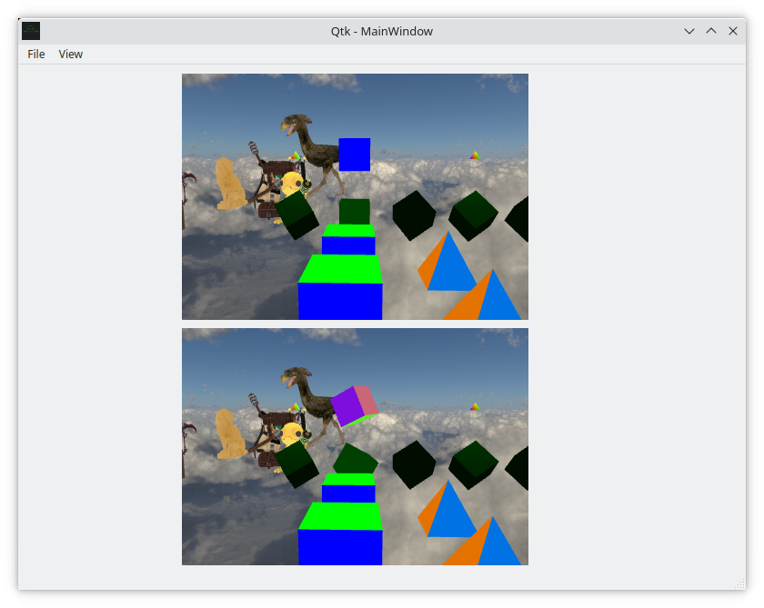
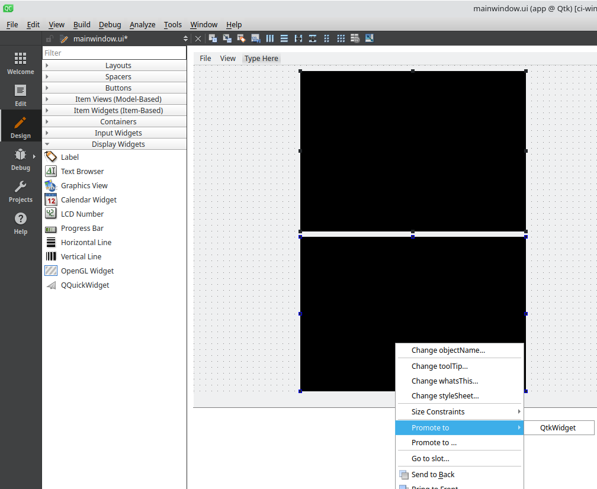
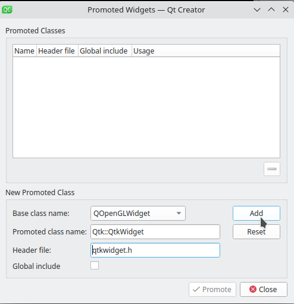

# Qtk

Practice project for learning about using OpenGL in Qt widget applications.
Model loader using [Assimp](https://assimp.org/) within a Qt widget application.

You can import your own models within `app/examplescene.cpp`, inside the
`ExampleScene::init()` function. Rotations and translations
happen in `ExampleScene::update()`.

To get textures loading on models look into [material files](http://www.paulbourke.net/dataformats/mtl/)
and see some examples in the `resources/models/` directory.


### Building

Builds are configured for CLion or [Qt Creator](https://github.com/qt-creator/qt-creator).
Simply open the root `CMakeLists.txt` with either of these editors and configurations will be loaded.

This project has been ported to Qt6, which is not yet available in Ubuntu apt repositories.
To run this project, you will *need* to install [Qt6 Open Source Binaries](https://www.qt.io/download-qt-installer) for your system.
Be sure to take note of the Qt6 installation directory, as we will need it to correctly set our `CMAKE_PREFIX_PATH` in the next steps.

Once Qt6 is installed, to build and run `qtk` on Ubuntu -
```bash
sudo apt update -y && sudo apt install freeglut3-dev libassimp-dev cmake build-essential git
git clone https://gitlab.com/shaunrd0/qtk
cmake -DCMAKE_PREFIX_PATH=$HOME/Qt/6.3.1/gcc_64 -S qtk/ -B qtk/build/ && cmake --build qtk/build/ -j $(nproc --ignore=2) --target qtk-main
./qtk/build/qtk-main
```

By default, the build will initialize Assimp as a git submodule and build from source.
We can turn this off by setting the `-DQTK_UPDATE_SUBMODULES=OFF` flag when running CMake.
This will greatly increase build speed, but we will need to make sure Assimp is available either system-wide or using a custom `CMAKE_PREFIX_PATH`.
Using `-DQTK_UPDATE_SUBMODULES=ON` supports providing assimp on cross-platform builds (Windows / Mac / Linux) and may be easier to configure.

```bash
sudo apt update -y && sudo apt install freeglut3-dev libassimp-dev cmake build-essential git
git clone https://gitlab.com/shaunrd0/qtk
cmake -DQTK_UPDATE_SUBMODULES=OFF -DCMAKE_PREFIX_PATH=$HOME/Qt/6.3.1/gcc_64 -S qtk/ -B qtk/build/ && cmake --build qtk/build/ -j $(nproc --ignore=2) --target qtk-main
#cmake -DQTK_UPDATE_SUBMODULES=OFF -DCMAKE_PREFIX_PATH=$HOME/Qt/6.3.1/gcc_64;/path/to/assimp/dir -S qtk/ -B qtk/build/ && cmake --build qtk/build/ -j $(nproc --ignore=2) --target qtk-main
./qtk/build/qtk-main
```

You can fly around the scene if you hold the right mouse button and use WASD.
If you see a small triangle floating by a model it represents the light source
that is being used for the shader rendering the model. These appear on models
using phong, specular, and diffuse lighting techniques.


Spartan with no normals -


Spartan with normals -




### QtkWidget in Qt Creator

The `QtkWidget` class is exported as a shared library for use in Qt Creator's design mode.
We can add more QtkWidgets to view and render the scene from multiple perspectives.
There is still some work to be done here, so there isn't a builtin way to add an additional view within the application.



After building Qtk, we can drag and drop an `OpenGL Widget` onto the `mainwindow.ui`.
Then right-click the new OpenGLWidget and `Promote To->QtkWidget` to add a second view.



If we demote or delete all widgets in `mainwindow.ui` and rebuild the project, Qt Creator will drop `QtkWidget` from the list of possible promoted widgets.
Add an `OpenGL Widget` to the UI, right-click it and navigate to `Promote Widget...` and enter the information below.



After you fill out the `New Promoted Class` form, click `Add` *and*`Promote`, then rebuild.
After following these steps Qt Creator will list `QtkWidget` as an option to promote `OpenGL Widgets` again.


## Model Artists

"Alien Hominid" (https://skfb.ly/onStx) by Nwilly_art is licensed under Creative Commons Attribution (http://creativecommons.org/licenses/by/4.0/).

"Scythe World Of Warcraft" (https://skfb.ly/6UooG) by Warcraft-3D-Models is licensed under Creative Commons Attribution (http://creativecommons.org/licenses/by/4.0/).

"Spartan Armour MKV - Halo Reach" (https://skfb.ly/6QVvM) by McCarthy3D is licensed under Creative Commons Attribution (http://creativecommons.org/licenses/by/4.0/).

"Survival Guitar Backpack (Low Poly)" (https://skfb.ly/6RnCB) by Berk Gedik is licensed under Creative Commons Attribution (http://creativecommons.org/licenses/by/4.0/).
Model by Berk Gedik, from: https://sketchfab.com/3d-models/survival-guitar-backpack-low-poly-799f8c4511f84fab8c3f12887f7e6b36
Modified (learnopengl.com) material assignment (Joey de Vries) for easier load in OpenGL model loading chapter, and renamed albedo to diffuse and metallic to specular to match non-PBR lighting setup.

"Terror-bird (NHMW-Geo 2012/0007/0001)" (https://skfb.ly/onAWy) by Natural History Museum Vienna is licensed under Creative Commons Attribution-NonCommercial (http://creativecommons.org/licenses/by-nc/4.0/).

"Golden Lion Sitting OBJ Low Poly FREE" (https://skfb.ly/onZAH) by LordSamueliSolo is licensed under Creative Commons Attribution (http://creativecommons.org/licenses/by/4.0/).
