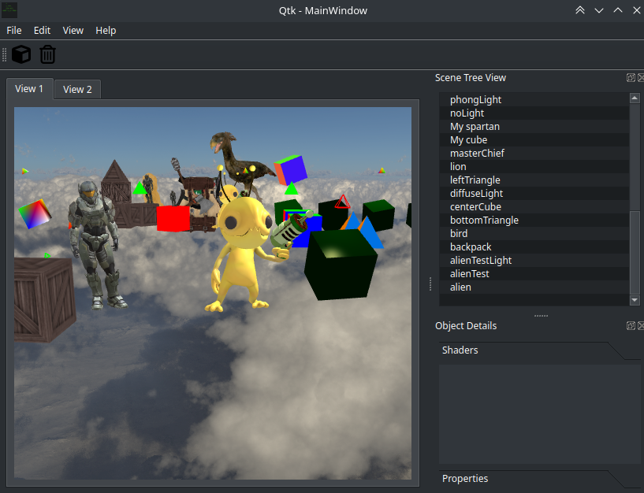
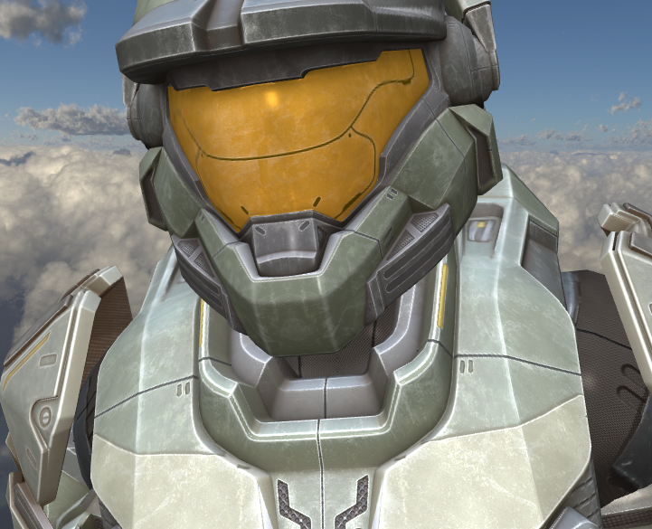

# Qtk

Practice project for learning about using OpenGL in Qt widget applications.
Model loader using [Assimp](https://assimp.org/) within a Qt widget application.

You can import your own models within `mainwdget.cpp`, inside the
`MainWidget::initObjects()` function. I've commented throughout the code there
to explain which model or example I'm modifying. Rotations and translations
happen in `MainWidget::update()`, to get textures loading on models look into 
[material files](http://www.paulbourke.net/dataformats/mtl/) and see some 
examples in the `resources/models/` directory. For more in-depth examples, see
`scene.h` and `scene.cpp`

Can be built with cmake manually or using 
[Qt Creator](https://github.com/qt-creator/qt-creator).
For the build to be successful, I've found through testing on VMs that the system requires around 6GB of RAM.
This is mostly due to the large .obj files that are built into the project using [Qt Resource System](https://doc.qt.io/qt-6/resources.html)

This project has been ported to Qt6, which is not yet available in Ubuntu apt repositories.
To run this project, you will *need* to install [Qt6 Open Source Binaries](https://www.qt.io/download-qt-installer) for your system.
Be sure to take note of the Qt6 installation directory, as we will need it to correctly set our `CMAKE_PREFIX_PATH` in the next steps.

Once Qt6 is installed, to build and run `qtk` on Ubuntu -
```bash
sudo apt update -y && sudo apt install freeglut3-dev libassimp-dev cmake build-essential git
git clone https://gitlab.com/shaunrd0/qtk && cd qtk
mkdir build && cd build
cmake .. -DCMAKE_PREFIX_PATH=$HOME/Qt6/6.2.3/gcc_64 && cmake --build .
./qtk
```

You can fly around the scene if you hold the right mouse button and use WASD.
If you see a small triangle floating by a model it represents the light source
that is being used for the shader rendering the model. These appear on models
using phong, specular, and diffuse lighting techniques.



Spartan with no normals -



Spartan with normals -


## Model Artists


"Alien Hominid" (https://skfb.ly/onStx) by Nwilly_art is licensed under Creative Commons Attribution (http://creativecommons.org/licenses/by/4.0/).

"Scythe World Of Warcraft" (https://skfb.ly/6UooG) by Warcraft-3D-Models is licensed under Creative Commons Attribution (http://creativecommons.org/licenses/by/4.0/).

"Spartan Armour MKV - Halo Reach" (https://skfb.ly/6QVvM) by McCarthy3D is licensed under Creative Commons Attribution (http://creativecommons.org/licenses/by/4.0/).

"Survival Guitar Backpack (Low Poly)" (https://skfb.ly/6RnCB) by Berk Gedik is licensed under Creative Commons Attribution (http://creativecommons.org/licenses/by/4.0/).
Model by Berk Gedik, from: https://sketchfab.com/3d-models/survival-guitar-backpack-low-poly-799f8c4511f84fab8c3f12887f7e6b36
Modified (learnopengl.com) material assignment (Joey de Vries) for easier load in OpenGL model loading chapter, and renamed albedo to diffuse and metallic to specular to match non-PBR lighting setup.

"Terror-bird (NHMW-Geo 2012/0007/0001)" (https://skfb.ly/onAWy) by Natural History Museum Vienna is licensed under Creative Commons Attribution-NonCommercial (http://creativecommons.org/licenses/by-nc/4.0/).

"Golden Lion Sitting OBJ Low Poly FREE" (https://skfb.ly/onZAH) by LordSamueliSolo is licensed under Creative Commons Attribution (http://creativecommons.org/licenses/by/4.0/).

